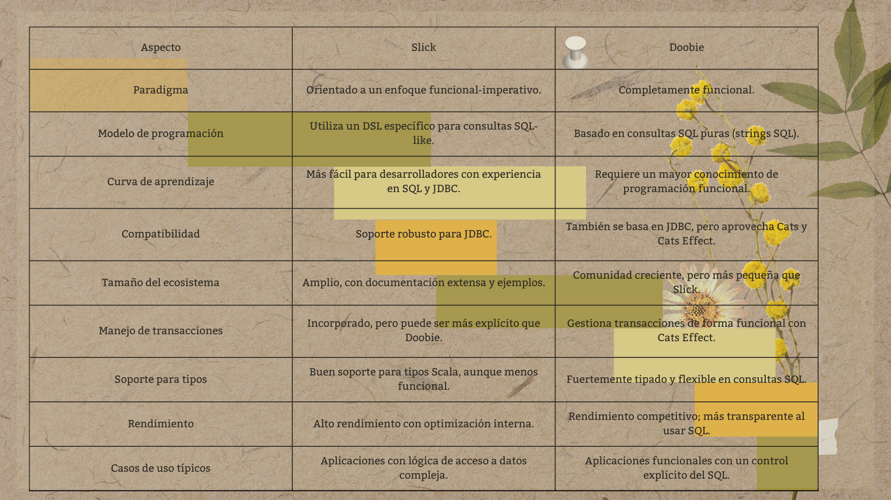
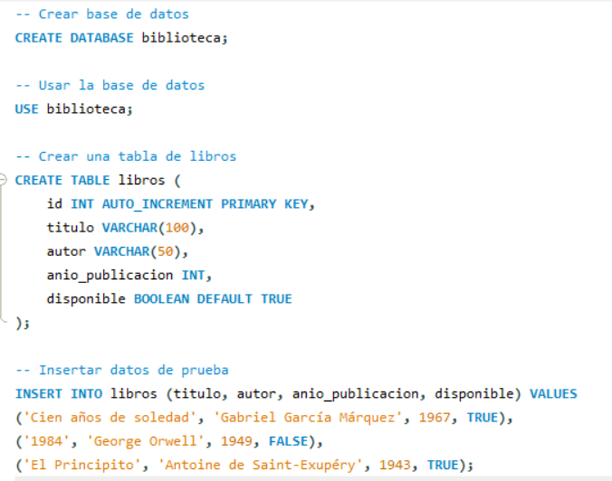
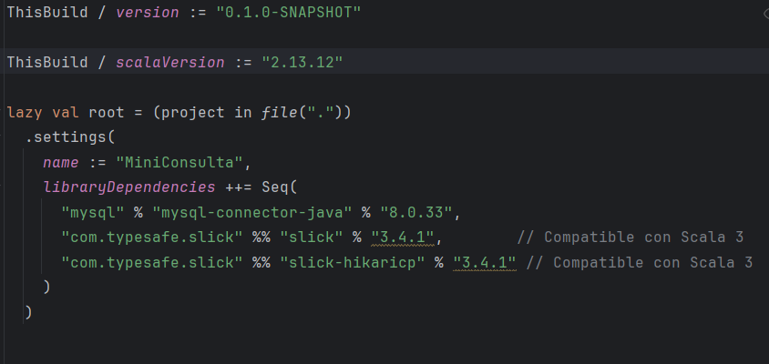
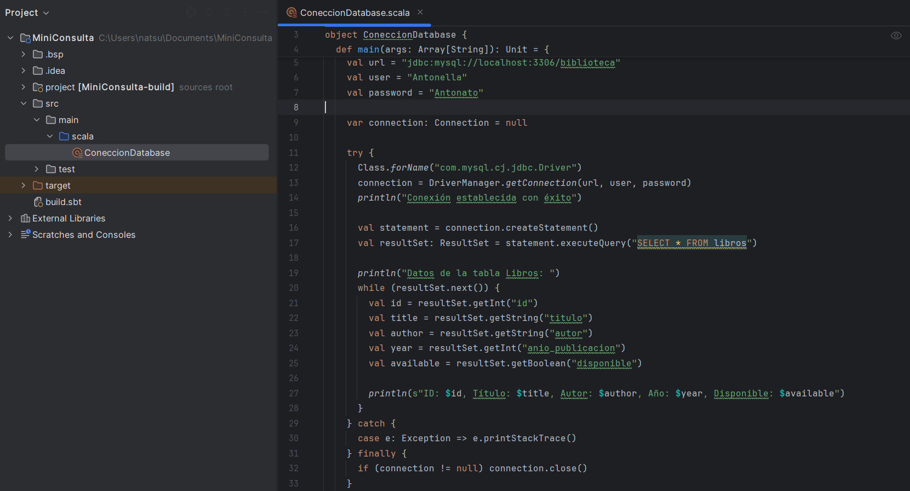
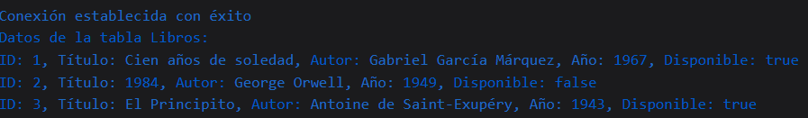

# Conexion-base-de-datos-relacional
B2 - Trabajo Consulta 2: Conexión base de datos relacional

## 1. ¿Qué es JDBC y cuáles son sus componentes?
 Java Database Connectivity (JDBC) es una interfaz estándar para acceder a bases de datos SQL que ofrece un acceso uniforme a diversas bases de datos relacionales. Esta tecnología no solo facilita la conexión y manipulación de datos, sino que también proporciona una base sólida para el desarrollo de herramientas y utilidades avanzadas. Gracias a la API de JDBC, los desarrolladores pueden enviar instrucciones SQL a casi cualquier sistema de gestión de bases de datos sin la necesidad de crear programas específicos para cada uno de ellos. Esto significa que no es necesario desarrollar aplicaciones distintas para interactuar con bases de datos como Sybase, Oracle o Informix, lo que simplifica enormemente el proceso de desarrollo y mantenimiento de aplicaciones que requieren acceso a datos. Además, JDBC permite la integración de diferentes fuentes de datos, lo que potencia la flexibilidad y escalabilidad en el manejo de información.

### Componentes de JDBC
 1. Driver JDBC (Controlador JDBC)

  El controlador JDBC actúa como un intermediario entre la aplicación Java y el sistema de gestión de bases de datos (DBMS). JDBC define varios tipos de controladores para facilitar la conexión con diferentes bases de datos. Los tipos de controladores son:

   - Tipo 1: JDBC-ODBC Bridge (obsoleto): Permite la conexión a través de ODBC, pero ya no se recomienda por su falta de eficiencia.
   - Tipo 2: Controlador nativo-API: Utiliza las API nativas del DBMS para conectarse, ofreciendo un mejor rendimiento que el Tipo 1.
   - Tipo 3: Controlador nativo-protocolo: Este es el más comúnmente utilizado, ya que permite la conexión a través de un servidor intermedio, facilitando el acceso a múltiples bases de datos.

 2. Connection (Conexión)

  Este componente gestiona la conexión con la base de datos. Se obtiene mediante el DriverManager y permite iniciar transacciones, configurar propiedades de conexión y cerrar la conexión de forma adecuada.

 3. Statement (Declaración)

  Permite ejecutar consultas SQL estáticas que no contienen parámetros. Se utiliza para ejecutar comandos SQL sencillos como SELECT, INSERT, UPDATE, entre otros.

 4. PreparedStatement (Declaración Preparada)

  Similar al Statement, pero con la capacidad de ejecutar consultas parametrizadas. Esto no solo ayuda a prevenir inyecciones SQL, sino que también mejora el rendimiento en consultas que se ejecutan repetidamente, ya que se compilan una sola vez.

 5. ResultSet (Conjunto de Resultados)

  Este objeto contiene los resultados devueltos por una consulta SQL. Permite recorrer los datos obtenidos de la base de datos, facilitando la manipulación y visualización de la información.

 6. DriverManager

  Actúa como el gestor de controladores JDBC, responsable de establecer conexiones con la base de datos según la URL de conexión proporcionada. Administra múltiples controladores y selecciona el adecuado en función de la URL especificada.

 7. SQLException

  Esta clase maneja los errores que pueden surgir durante la ejecución de operaciones relacionadas con la base de datos. 
  Proporciona información detallada sobre el tipo de error, facilitando el diagnóstico y la resolución de problemas en las aplicaciones.

 Estos componentes son fundamentales para el funcionamiento de JDBC, permitiendo a los desarrolladores interactuar de manera eficiente y segura con bases de datos relacionales.

## 2. Librerias en Scala que permiten conectarse a una Base de Datos

 
 
 Ambas librerías son excelentes opciones, pero la elección depende de tu estilo de programación:

  - Slick es ideal si prefieres un enfoque más DSL y un poco menos funcional.
  - Doobie es una buena elección si quieres mantenerte completamente en el paradigma funcional.
 
## 3. ¿Cómo establecer una conexión a una Base de Datos Relacional?
 ### 1. Creamos la Base de Datos en MySQL.
  
 ### 2. Importamos la dependecia a nuestro proyecto de Scala con el sbt.
  
 ### 3. Luego creamos un archivo en Scala para conectar la base de datos.
  
 ### 4. Probamos la conexión con la base de datos realizando la consulta de los datos de la tabla creada previamente.
 